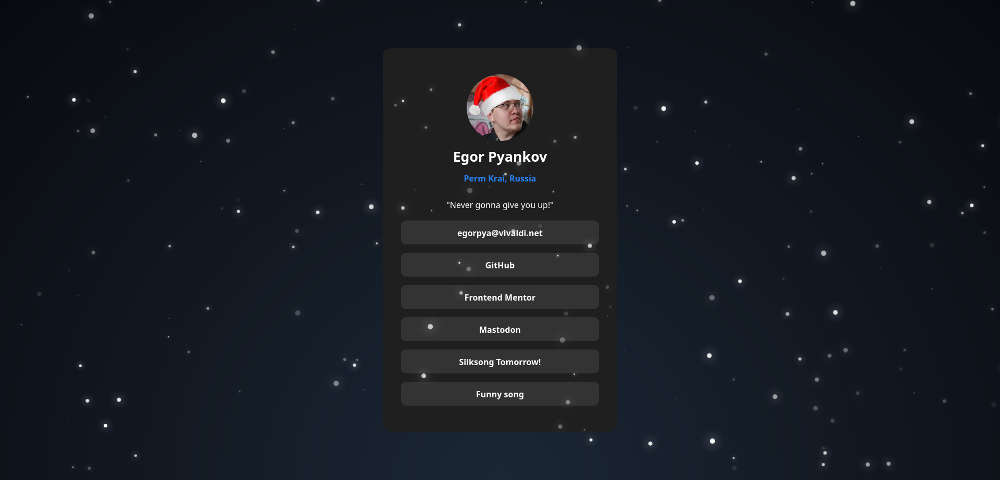

# Frontend Mentor - Social links profile solution

This is a solution to the [Social links profile challenge on Frontend Mentor](https://www.frontendmentor.io/challenges/social-links-profile-UG32l9m6dQ). Frontend Mentor challenges help you improve your coding skills by building realistic projects.

## Overview

## My process

### Built with

- Semantic HTML5 markup
- Flexbox
- CSS Grid
- Mobile-first workflow
- [Pure-snow.js](https://github.com/hyperstown/pure-snow.js?tab=readme-ov-file) - JS library

### What I am most proud of?

This time I did the project really fast - in just 4 hours! Yes, the project was pretty easy, but nevertheless, I enjoyed making it!

The main addition to the site is Snow particles from [this repo](https://github.com/hyperstown/pure-snow.js?tab=readme-ov-file). To comply with MIT license, I added the same as well.

Also, I included Click to Copy function to the email button, because why not!

## Author

- Frontend Mentor - [@egorpya](https://www.frontendmentor.io/profile/egorpya)
- Mastodon - [@egorp](https://social.vivaldi.net/@egorp) (inactive for some time already)
